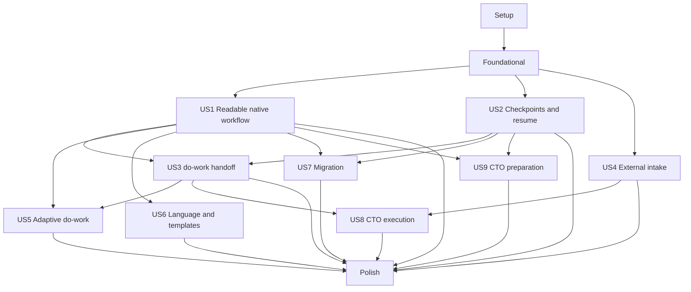

---

description: "Executable task list for the readable specification workflow"
---

# Tasks: Readable Specification Workflow

**Input**: Design documents from `/specs/001-redesign-spec-workflow/`

**Prerequisites**: `plan.md`, `spec.md`, `research.md`, `data-model.md`, `contracts/`, `quickstart.md`, `.specify/memory/constitution.md`

**Tests**: Required by FR-032, SC-018–SC-024, the implementation plan, and the project constitution. Write the focused tests in each story before its implementation and prove they fail for the missing contract.

**Organization**: Tasks are grouped by user story. Setup and Foundational contain only shared infrastructure that cannot belong to one independently deliverable story.

## Format: `[ID] [P?] [Story] Description`

- **[P]**: Safe to execute in parallel after prior non-parallel prerequisites complete because the task owns different files and has no dependency on another incomplete `[P]` task.
- **[Story]**: Maps the task to the corresponding user story in `spec.md`.
- Every task names the exact file or directory it changes and the observable contract it must establish.

## Phase 1: Setup (Shared Test Infrastructure)

**Purpose**: Establish deterministic fixtures used by every later contract and runtime scenario without adding production behavior.

- [ ] T001 Create valid and invalid specification aggregate fixture builders for workspace, constitution binding, handoff, claim, and conformance inputs in `packages/core/test/fixtures/specification-fixtures.ts`
- [ ] T002 [P] Create authorized scratch-repository and runtime-evidence fixture builders in `packages/e2e/src/specification-fixtures.ts`
- [ ] T003 [P] Add complete, incomplete, ambiguous, hostile, and legacy source bundles for Spec Kit, OpenSpec, BMAD, Superpowers, XPowers, and generic Markdown under `packages/e2e/fixtures/specification/`

**Checkpoint**: Shared tests can create deterministic native, imported, migrated, passing, and fail-closed inputs without duplicating fixture logic.

---

## Phase 2: Foundational (Blocking Shared Contracts)

**Purpose**: Add the branch-independent aggregate, clean completion-contract cutover, renderer/provider registries, and constitution prerequisite required by every user story.

**Critical**: No user story implementation starts until this phase is complete.

### Tests for Shared Contracts

- [ ] T004 [P] Add failing public and persisted cutover tests for `quality_gates_and_artifacts`, `CompletionQualityGateStatus`, and `quality_gate_status` in `packages/core/test/completion-quality-gates.test.ts`
- [ ] T005 [P] Add failing identity, safe-path, explicit-selector, atomic-state, and migration tests for feature workspaces in `packages/core/test/specification-workspace.test.ts`
- [ ] T006 [P] Add failing schema, immutable-artifact, renderer-registry, hash, history, and path-escape tests in `packages/core/test/specification-artifact-contract.test.ts`
- [ ] T007 [P] Add failing native-default, explicit-override, unique-provider, ambiguous-provider, usability, exact-resume, and semantic-impact tests in `packages/core/test/specification-constitution.test.ts`

### Implementation for Shared Contracts

- [ ] T008 Replace the exported DoD-labelled completion acceptance and artifact status types with `quality_gates_and_artifacts`, `CompletionQualityGateStatus`, and `quality_gate_status` in `packages/core/src/engine/types.ts`, `packages/core/src/commands/classification-contract.ts`, and `packages/core/src/index.ts`
- [ ] T009 Implement one provenance-recording persisted migration from legacy completion intent and artifact fields, with no active aliases, in `packages/core/src/engine/state.ts`, `packages/core/src/engine/profile.ts`, and `packages/core/src/engine/workflow-contract.ts`
- [ ] T010 Migrate completion artifact observability summaries and serialization to `quality_gate_status` in `packages/core/src/observability/events.ts`, `packages/core/src/observability/recorder.ts`, and `packages/core/test/observability/recorder.test.ts`
- [ ] T011 Update active workflow completion intents and JSON validation to `quality_gates_and_artifacts` in `packages/core/workflows/_schema.json`, every profile in `packages/core/workflows/`, and every profile in `packages/omp-workflows-internal/workflows/`
- [ ] T012 Define the versioned FeatureWorkspace, phase, validation, checkpoint, traceability, import, handoff, claim, and conformance contracts in `packages/core/src/specification/types.ts` and export them from `packages/core/src/index.ts`
- [ ] T013 Implement immutable feature identity, `specs/<feature-id>/` and `.work-state/features/<feature-id>/` resolution, safe atomic persistence, and explicit run selection in `packages/core/src/specification/workspace.ts`, `packages/core/src/engine/state.ts`, and `packages/core/src/engine/run.ts`
- [ ] T014 Add explicit `feature_id` and `run_key` selectors to status, instructions, begin, complete, checkpoint, and advance tool schemas without trusting `.active-feature` in `packages/core/src/index.ts`
- [ ] T015 Add executable strict schemas for feature workspace, phase artifacts, constitution records, handoff, claims, imports, and conformance results in `packages/core/workflows/artifacts-schema.json` and `packages/core/workflows/_schema.json`
- [ ] T016 Implement a registered deterministic Markdown renderer with bounded paths, atomic writes, source/content hashes, revision history, and revalidation in `packages/core/src/specification/materialize.ts`, `packages/core/src/engine/types.ts`, and `packages/core/src/engine/durable.ts`
- [ ] T017 Implement template resolution precedence, stable semantic markers, content hashing, and shipped baseline loading in `packages/core/src/specification/templates.ts` and `packages/core/workflows/templates/specification/`
- [ ] T018 Implement reusable validation findings, traceability checks, semantic-section hashes, and typed next actions in `packages/core/src/specification/validation.ts`
- [ ] T019 Implement provider registration and explicit override → unique discovered provider → native `CONSTITUTION.md` resolution with safe local-only discovery in `packages/core/src/specification/constitution-provider.ts` and `packages/core/src/gates/constitution.ts`
- [ ] T020 Implement the idempotent `ensure_project_constitution` origin descriptor, blocking bootstrap continuation, two-decision resume marker, and exact native/import resume target in `packages/core/src/specification/prerequisite.ts`, `packages/core/src/engine/types.ts`, and `packages/core/src/engine/durable.ts`
- [ ] T021 Implement exact constitution bindings, semantic hashes, artifact-scoped `affected`/`no_impact` assessments, and dependency-closure staleness in `packages/core/src/specification/constitution-impact.ts` and `packages/core/src/specification/workspace.ts`
- [ ] T022 Export bounded constitution-provider, template-renderer, and format-recognizer registration seams without bundle-specific defaults in `packages/core/src/specification/registry.ts` and `packages/core/src/index.ts`

**Checkpoint**: Core can address one explicit feature aggregate, migrate old completion contracts once, resolve or bootstrap one project constitution, and persist safe versioned artifacts through public extension seams.

---

## Phase 3: User Story 1 - Create a Readable Implementation-Ready Specification (Priority: P1)

**Goal**: Provide explicit Constitution → Specify → Plan → Tasks progression that produces discoverable Markdown, validation projections, status, and next action without JSON inspection.

**Independent Test**: Start from a natural-language request in a repository with no Spec Kit, approve the generated constitution, complete Specify, Plan, and Tasks, and locate problem, scope, requirements, decisions, task order, validation, approvals, and next action only in `specs/<feature-id>/`.

### Tests for User Story 1

- [ ] T023 [P] [US1] Add failing native constitution and Specify → Plan → Tasks profile contract tests in `packages/core/test/specification-native-flow.test.ts`
- [ ] T024 [P] [US1] Add failing direct command registration, explicit feature selection, prerequisite, and next-command tests in `packages/core/test/specification-command.test.ts`
- [ ] T025 [P] [US1] Add a failing real-runtime explicit phase scenario and assertions in `packages/e2e/scenarios/spec-workflow.json` and `packages/e2e/test/spec-workflow.test.ts`

### Implementation for User Story 1

- [ ] T026 [P] [US1] Ship the zero-dependency constitution draft/revise/validate profile and framework-neutral template in `packages/core/workflows/constitution.json` and `packages/core/workflows/templates/constitution/default.md`
- [ ] T027 [P] [US1] Define typed ConstitutionDraft, SpecifyDraft, PlanDraft, TaskGraph, phase-validation, and status artifacts in `packages/core/workflows/artifacts-schema.json`
- [ ] T028 [US1] Replace the JSON-only profile with declared constitution prerequisite, subagent-authored Specify/Plan/Tasks stages, deterministic document stages, validation gates, and phase checkpoints in `packages/core/workflows/spec-preparation.json`
- [ ] T029 [US1] Implement capability-bound phase dispatch, immutable phase version creation, upstream bindings, and Tasks handoff trigger in `packages/core/src/specification/phase.ts` and `packages/core/src/engine/durable.ts`
- [ ] T030 [US1] Materialize `spec.md`, `plan.md`, `tasks.md`, `status.md`, phase validation reports, history revisions, and `handoff.md` projections in `packages/core/src/specification/materialize.ts`
- [ ] T031 [US1] Enforce Specify sections, scope, non-goals, actors, journeys, testable requirements, edge cases, assumptions, dependencies, and success criteria in `packages/core/src/specification/validation.ts`
- [ ] T032 [US1] Enforce Plan decisions, alternatives, repository grounding, contracts, data/control flow, migration, security, operations, verification strategy, and post-design constitution re-check in `packages/core/src/specification/validation.ts`
- [ ] T033 [US1] Enforce an acyclic Tasks graph with requirement, acceptance, decision, affected-scope, dependency, expected-outcome, and verification-evidence links in `packages/core/src/specification/validation.ts`
- [ ] T034 [US1] Implement `/specify`, `/spec-plan`, and `/spec-tasks` parsers and orchestration prompts with explicit feature selection and exact next actions in `packages/core/src/commands/specification.ts`
- [ ] T035 [US1] Register the three direct phase commands and export their handlers through `packages/core/src/commands/register.ts` and `packages/core/src/index.ts`
- [ ] T036 [US1] Register shipped specification profiles, renderers, templates, and the native provider through the owning bundle without changing owner semantics in `packages/fullstack/src/index.ts` and `packages/fullstack/src/workflow-commands.ts`
- [ ] T037 [US1] Preserve generated workspace paths, checkpoint transcripts, phase documents, and validation evidence in the real harness through `packages/e2e/src/scenario.ts`, `packages/e2e/src/driver.ts`, and `packages/e2e/src/report.ts`

**Checkpoint**: User Story 1 is independently usable as the MVP; all content is worker-attributable and all current state is readable from the feature workspace.

**Parallel Example**:

```text
After Foundational: T023, T024, and T025 can define independent failing contracts in parallel.
After those contracts: T026 and T027 can add separate profile/template and schema assets in parallel.
```

---

## Phase 4: User Story 2 - Review, Revise, Pause, and Resume at Checkpoints (Priority: P1)

**Goal**: Make validation blocking and checkpoint decisions explicit, durable, attributable, revision-aware, and safe across interrupted sessions.

**Independent Test**: Feed valid, incomplete, contradictory, untestable, broken-traceability, and constitution-conflicting artifacts through all three decisions and verify correct revision, stop/resume, and targeted staleness behavior.

### Tests for User Story 2

- [ ] T038 [P] [US2] Add failing approve-continue, request-changes, approve-stop, trusted-proof, idempotency, and no-agent-approval tests in `packages/core/test/specification-checkpoints.test.ts`
- [ ] T039 [P] [US2] Add failing invalid-artifact blocking, upstream revision, manual edit, language/template drift, and targeted constitution staleness tests in `packages/core/test/specification-staleness.test.ts`
- [ ] T040 [P] [US2] Add failing interrupted-session and revision-loop runtime assertions in `packages/e2e/test/spec-workflow-resume.test.ts`

### Implementation for User Story 2

- [ ] T041 [US2] Add hard-human `constitution_approval`, `specification_phase_approval`, and compatibility decision policies with exact allowed decisions in `packages/core/src/engine/types.ts`, `packages/core/src/engine/checkpoints.ts`, and `packages/core/workflows/_schema.json`
- [ ] T042 [US2] Implement approve-and-continue dispatch, approve-and-stop return, and feedback-bound same-phase re-dispatch with a new epoch/version in `packages/core/src/specification/phase.ts` and `packages/core/src/engine/durable.ts`
- [ ] T043 [US2] Archive replaced readable revisions and mark only semantically affected downstream versions, approvals, and handoffs stale in `packages/core/src/specification/workspace.ts` and `packages/core/src/engine/state.ts`
- [ ] T044 [US2] Render blocking locations, violated criteria, remediation command, approval proof, and first valid next action in `packages/core/src/specification/validation.ts` and `packages/core/src/specification/materialize.ts`
- [ ] T045 [US2] Extend the real runtime scenario with request changes, approve stop, interruption after approval, exact resume, and no detached reviewer in `packages/e2e/scenarios/spec-workflow-resume.json`

**Checkpoint**: Each valid phase exposes exactly three decisions; invalid content exposes no checkpoint; interruption never repeats approved work.

**Parallel Example**:

```text
T038, T039, and T040 can establish checkpoint, staleness, and runtime-resume failures in parallel before T041–T045.
```

---

## Phase 5: User Story 3 - Hand an Approved Specification to `/do-work` (Priority: P1)

**Goal**: Consume one approved handoff without rediscovery and block feature completion until every approved requirement and scenario has current implementation, review, and required executed-test evidence.

**Independent Test**: Run `/do-work --spec <feature-id>` against a ready native handoff and prove successful closure plus missing, failed, stale, contradictory, cross-handoff, and changed-intent failures.

### Tests for User Story 3

- [ ] T046 [P] [US3] Add failing handoff readiness, exact-version binding, ambiguity, and exclusive claim tests in `packages/core/test/specification-handoff-claims.test.ts`
- [ ] T047 [P] [US3] Add failing complete, missing, review-rejected, test-failed, stale, contradictory, changed-intent, replay, and no-override matrix tests in `packages/core/test/specification-conformance.test.ts`
- [ ] T048 [P] [US3] Add failing `/do-work --spec` selection, rediscovery skip, stale routing, and conflict tests in `packages/core/test/do-work-specification.test.ts`
- [ ] T049 [P] [US3] Add failing real-runtime ready-handoff and completion-conformance assertions in `packages/e2e/test/spec-do-work.test.ts`

### Implementation for User Story 3

- [ ] T050 [P] [US3] Build the frozen executor-neutral handoff and one current readiness predicate from approved traceability in `packages/core/src/specification/handoff.ts`
- [ ] T051 [P] [US3] Implement acquire, conflict, block, release, and pass-only completion transitions for handoff-digest execution claims in `packages/core/src/specification/claims.ts`
- [ ] T052 [P] [US3] Implement deterministic requirement/scenario closure rows, observable-behavior test obligations, quality-gate rows, and changed-intent routing in `packages/core/src/specification/conformance.ts`
- [ ] T053 [US3] Bind executable handoff, execution-claim, closure-entry, and implementation-conformance schemas to artifact validation in `packages/core/workflows/artifacts-schema.json` and `packages/core/src/engine/artifact-contract.ts`
- [ ] T054 [US3] Require a current passing conformance result before terminal advancement can complete a run, claim, or workspace in `packages/core/src/engine/durable.ts` and `packages/core/src/engine/workflow-contract.ts`
- [ ] T055 [US3] Resolve explicit or uniquely matching workspaces, verify constitution impact, acquire claims, skip discovery/planning, and route non-ready work in `packages/core/src/commands/do-work.ts`
- [ ] T056 [US3] Render the frozen `handoff.md` and `validation/implementation-conformance.md` with exact digests and evidence findings in `packages/core/src/specification/materialize.ts`
- [ ] T057 [US3] Normalize implementation, review, QA, runtime-test, and profile-gate artifact references against the active claim and handoff digest in `packages/core/src/specification/conformance.ts` and `packages/core/src/engine/artifacts.ts`
- [ ] T058 [US3] Add ready, claimed, blocked-closure, repaired, changed-intent, and completed runtime paths to `packages/e2e/scenarios/spec-do-work.json`

**Checkpoint**: `/do-work` starts from the approved contract, never silently changes intent, and cannot complete on generic quality gates alone.

**Parallel Example**:

```text
T046–T049 can define independent handoff, conformance, command, and runtime contracts in parallel.
After shared types are stable, T050, T051, and T052 can implement separate handoff, claim, and conformance modules in parallel.
```

---

## Phase 6: User Story 4 - Execute Specifications from Other Frameworks (Priority: P1)

**Goal**: Import authorized local specifications read-only, validate them through one generic contract, preserve provenance, and produce the same approved handoff used by native workspaces.

**Independent Test**: Import complete and unsafe fixtures from each named framework plus generic Markdown, approve one compatible handoff, execute it, and verify source bytes remain unchanged while all unsafe/non-ready cases block.

### Tests for User Story 4

- [ ] T059 [P] [US4] Add failing safe-discovery, immutable snapshot, generic mapping, supplement, source-change, secret, symlink, size, and idempotency tests in `packages/core/test/specification-import.test.ts`
- [ ] T060 [P] [US4] Add failing framework-recognition, ambiguity, ignored-candidate, and no-framework-runtime tests in `packages/fullstack/test/specification-recognizers.test.ts`
- [ ] T061 [P] [US4] Add failing complete, incomplete, ambiguous, hostile, and source-immutability runtime assertions in `packages/e2e/test/spec-import.test.ts`

### Implementation for User Story 4

- [ ] T062 [US4] Ship the read-only intake, constitution prerequisite, compatibility validation, supplement, approval, and handoff profile in `packages/core/workflows/spec-import.json`
- [ ] T063 [US4] Implement bounded local discovery, realpath/symlink enforcement, text allowlists, redaction, immutable fingerprints, revision capture, and generic normalization in `packages/core/src/specification/import.ts`
- [ ] T064 [US4] Build readable compatibility mappings, ready/supplement-required/blocked/unsupported results, attributable supplements, and imported handoffs in `packages/core/src/specification/import.ts` and `packages/core/src/specification/materialize.ts`
- [ ] T065 [P] [US4] Implement the optional existing-file constitution provider and artifact recognizer for Spec Kit without CLI execution in `packages/fullstack/src/specification/providers/speckit.ts` and `packages/fullstack/src/specification/recognizers/speckit.ts`
- [ ] T066 [P] [US4] Implement local OpenSpec artifact recognition and delta-baseline diagnostics in `packages/fullstack/src/specification/recognizers/openspec.ts`
- [ ] T067 [P] [US4] Implement local BMAD requirements, architecture, task, and validation artifact recognition in `packages/fullstack/src/specification/recognizers/bmad.ts`
- [ ] T068 [P] [US4] Implement local Superpowers plan and task artifact recognition in `packages/fullstack/src/specification/recognizers/superpowers.ts`
- [ ] T069 [P] [US4] Implement local XPowers canonical requirement and task-source recognition in `packages/fullstack/src/specification/recognizers/xpowers.ts`
- [ ] T070 [US4] Register named recognizers plus an always-available generic recognizer through `packages/fullstack/src/specification/recognizers/registry.ts` and `packages/fullstack/src/index.ts`
- [ ] T071 [US4] Implement and register `/spec-import <path> [--framework <id|generic>]` with explicit selection and exact compatibility next actions in `packages/core/src/commands/specification.ts` and `packages/core/src/commands/register.ts`
- [ ] T072 [US4] Re-hash source and constitution bindings before approval/dispatch, preserve unchanged-import approval idempotently, and stale changed imports in `packages/core/src/specification/import.ts` and `packages/core/src/specification/handoff.ts`
- [ ] T073 [US4] Add Spec Kit, OpenSpec, BMAD, Superpowers, XPowers, generic, ambiguous, and hostile import journeys to `packages/e2e/scenarios/spec-import.json`

**Checkpoint**: Complete external bundles reach one compatibility checkpoint and the shared handoff; source files remain byte-for-byte unchanged.

**Parallel Example**:

```text
T059, T060, and T061 can define core, bundle, and runtime failures in parallel.
After T063 defines normalized input, T065–T069 can implement separate recognizers in parallel.
```

---

## Phase 7: User Story 5 - Right-Size Work When No Specification Exists (Priority: P2)

**Goal**: Keep quick work lightweight while routing medium uncertainty and complex/risky work into the appropriate shared specification path.

**Independent Test**: Invoke `/do-work` without a workspace for quick, medium, complex, critical, low-confidence, security, and infrastructure fixtures and verify the exact preparation depth and durable nested resume.

### Tests for User Story 5

- [ ] T074 [P] [US5] Add failing preparation-depth, rationale, and no-invalid-dispatch classification tests in `packages/core/test/do-work-specification-routing.test.ts`
- [ ] T075 [P] [US5] Add failing nested full-profile pause, resume, and duplicate-run runtime assertions in `packages/e2e/test/spec-do-work-adaptive.test.ts`

### Implementation for User Story 5

- [ ] T076 [US5] Add quick, bounded-Specify, and full-specification routing outcomes based on complexity, confidence, security, and infrastructure risk in `packages/core/src/commands/classification-contract.ts` and `packages/core/src/commands/do-work.ts`
- [ ] T077 [US5] Reuse the exact native constitution prerequisite and phase profile for full preparation nested from `/do-work` in `packages/core/src/commands/do-work.ts` and `packages/core/src/specification/prerequisite.ts`
- [ ] T078 [US5] Persist one nested feature/run identity and resume it without duplicate capabilities, dispatches, artifacts, or approvals in `packages/core/src/engine/run.ts` and `packages/core/src/specification/workspace.ts`
- [ ] T079 [US5] Add quick, medium, complex, security-sensitive, paused, and resumed journeys to `packages/e2e/scenarios/spec-do-work-adaptive.json`

**Checkpoint**: `/do-work` records why it selected each depth and every full path is behaviorally identical to direct specification preparation.

**Parallel Example**:

```text
T074 and T075 can define classification and real-runtime resume failures in parallel before T076–T079.
```

---

## Phase 8: User Story 6 - Select Language and Adapt Templates (Priority: P2)

**Goal**: Resolve document language and templates predictably while preserving semantic markers, validation, traceability, and staleness rules.

**Independent Test**: Generate equivalent workspaces in two languages with valid and invalid project overrides, then change an approved language/template and verify only affected artifacts require regeneration and approval.

### Tests for User Story 6

- [ ] T080 [P] [US6] Add failing language precedence, mixed-prose, technical-identifier, marker, and post-approval staleness tests in `packages/core/test/specification-language-template.test.ts`
- [ ] T081 [P] [US6] Add failing two-language and project-template runtime assertions in `packages/e2e/test/spec-language-template.test.ts`

### Implementation for User Story 6

- [ ] T082 [P] [US6] Implement feature override → project default → initiating-request language selection and provenance in `packages/core/src/specification/language.ts`
- [ ] T083 [P] [US6] Implement feature override → workflow-owner default → shipped template selection and pre-dispatch required-marker rejection in `packages/core/src/specification/templates.ts`
- [ ] T084 [US6] Bind language/template hashes to phase versions and regenerate/stale only affected approvals after changes in `packages/core/src/specification/phase.ts` and `packages/core/src/specification/workspace.ts`
- [ ] T085 [US6] Show selected language, source, template id/hash, and regeneration next action in `packages/core/src/specification/materialize.ts`

**Checkpoint**: Localization never changes the machine contract or lets a project template remove mandatory content.

**Parallel Example**:

```text
T080 and T081 can define unit/runtime behavior in parallel; T082 and T083 can then implement independent language and template resolvers in parallel.
```

---

## Phase 9: User Story 7 - Recover and Migrate Existing Specification Runs (Priority: P2)

**Goal**: Migrate compatible legacy work with provenance and fresh approval while preserving incompatible source state and resuming interrupted new-format work exactly once.

**Independent Test**: Open compatible JSON-only, malformed, ambiguous, branch-derived, and interrupted fixtures and verify deterministic materialization, rejection, or resume with no inferred approval or data loss.

### Tests for User Story 7

- [ ] T086 [P] [US7] Add failing compatible, incompatible, branch-derived, missing-binding, and idempotent migration tests in `packages/core/test/specification-migration.test.ts`
- [ ] T087 [P] [US7] Add failing legacy materialization and interrupted-resume runtime assertions in `packages/e2e/test/spec-migration.test.ts`

### Implementation for User Story 7

- [ ] T088 [US7] Normalize compatible JSON-only artifacts into explicit feature identity, immutable versions, provenance, current constitution binding, and unapproved readable records in `packages/core/src/specification/migration.ts` and `packages/core/src/engine/state.ts`
- [ ] T089 [US7] Convert branch-derived and `.active-feature` legacy selectors only at the migration boundary and preserve blocked originals byte-for-byte in `packages/core/src/engine/state.ts`
- [ ] T090 [US7] Materialize migrated Markdown with a migration receipt and require new validation plus human approval before readiness in `packages/core/src/specification/migration.ts` and `packages/core/src/specification/materialize.ts`
- [ ] T091 [US7] Add compatible, malformed, branch-derived, and interrupted runs to `packages/e2e/scenarios/spec-migration.json`

**Checkpoint**: Legacy completion never implies new approval, and an interrupted current run resumes from its first unapproved phase without duplication.

**Parallel Example**:

```text
T086 and T087 can establish migration and runtime-resume contracts in parallel before T088–T091.
```

---

## Phase 10: User Story 8 - Execute Approved Specifications Through CTO Mode (Priority: P2)

**Goal**: Freeze one or more ready handoffs into a user-confirmed CTO team mapping, parallelize only safe slices, and close each feature through its own conformance matrix.

**Independent Test**: Execute two native/imported handoffs with independent and dependent tasks and prove preflight, claims, mapping confirmation, safe parallelism, traceability, per-feature isolation, and blocked completion behavior.

### Tests for User Story 8

- [ ] T092 [P] [US8] Add failing multi-workspace preflight, frozen-version, mapping-confirmation, dependency, ownership, and claim-conflict tests in `packages/core/test/cto-specification-execution.test.ts`
- [ ] T093 [P] [US8] Add failing per-handoff evidence partition, passing-feature isolation, blocked-feature claim retention, and cross-feature evidence rejection tests in `packages/core/test/cto-specification-conformance.test.ts`
- [ ] T094 [P] [US8] Add failing real-runtime CTO ready-handoff execution assertions in `packages/e2e/test/spec-cto-execution.test.ts`

### Implementation for User Story 8

- [ ] T095 [US8] Add versioned specification-to-team mappings, handoff bindings, task ownership, shared contracts, parallelization reasons, and checkpoint refs in `packages/core/src/cto/types.ts` and `packages/core/src/specification/types.ts`
- [ ] T096 [US8] Run common readiness, constitution-impact, project-boundary, version, dependency, and execution-claim preflight before CTO dispatch in `packages/core/src/cto/gates.ts`, `packages/core/src/cto/plan.ts`, and `packages/core/src/specification/claims.ts`
- [ ] T097 [US8] Parse explicit feature selections, freeze handoff digests, and present the mapping confirmation in `packages/core/src/commands/cto.ts`
- [ ] T098 [US8] Partition implementation/review/test evidence by frozen handoff and evaluate one conformance matrix per feature in `packages/core/src/engine/fan-in.ts` and `packages/core/src/specification/conformance.ts`
- [ ] T099 [US8] Serialize shared-file, contract, migration, destructive, and ordered slices while admitting independent task ownership in `packages/core/src/cto/plan.ts` and `packages/core/src/cto/slice-gate.ts`
- [ ] T100 [US8] Add mixed native/imported, independent/dependent, stale, claimed, passing, and blocked feature journeys to `packages/e2e/scenarios/spec-cto-execution.json`

**Checkpoint**: CTO dispatch starts only after user confirmation, and no feature can borrow approval or completion evidence from another handoff.

**Parallel Example**:

```text
T092, T093, and T094 can define preflight, conformance-isolation, and runtime failures in parallel before T095–T100.
```

---

## Phase 11: User Story 9 - Prepare Specifications Through CTO Mode (Priority: P3)

**Goal**: Let the resident CTO coordinate standard specification profiles for multiple feature workspaces while preserving per-feature human checkpoints and a hard stop before implementation.

**Independent Test**: Prepare two independent features and two facets of a third, mix checkpoint decisions, and verify standard workspaces, one writer per feature phase, isolated failures, visible queue reasons, and no automatic implementation.

### Tests for User Story 9

- [ ] T101 [P] [US9] Add failing independent-workspace, same-feature serialization, per-phase decision, mixed-review, queue, capacity, and no-nested-CTO tests in `packages/core/test/cto-specification-preparation.test.ts`
- [ ] T102 [P] [US9] Add failing real-runtime multi-feature preparation and hard-stop assertions in `packages/e2e/test/spec-cto-preparation.test.ts`

### Implementation for User Story 9

- [ ] T103 [US9] Schedule each feature through the standard constitution and specification profiles while serializing facets behind one phase writer in `packages/core/src/cto/scheduler.ts`, `packages/core/src/cto/run.ts`, and `packages/core/src/specification/prerequisite.ts`
- [ ] T104 [US9] Render one readable CTO review packet without granting approval authority in `packages/core/src/cto/specification-review-packet.ts` and `packages/core/src/specification/materialize.ts`
- [ ] T105 [US9] Record separate trusted decisions per workspace/phase and advance only eligible features after mixed answers in `packages/core/src/cto/decisions.ts` and `packages/core/src/specification/phase.ts`
- [ ] T106 [US9] Fold work into the resident CTO or queue it with capacity, depth, ownership, and active-phase reasons without nesting in `packages/core/src/cto/scheduler.ts` and `packages/core/src/gates/cto-nesting.ts`
- [ ] T107 [US9] End preparation after final Tasks approvals and require a separate explicit execution wave in `packages/core/src/cto/run.ts` and `packages/core/src/commands/cto.ts`
- [ ] T108 [US9] Add independent features, same-feature facets, mixed decisions, blocked slices, queue limits, and final hard stop to `packages/e2e/scenarios/spec-cto-preparation.json`

**Checkpoint**: CTO preparation returns standard implementation-ready handoffs for review and never treats preparation completion as execution intent.

**Parallel Example**:

```text
T101 and T102 can define core and real-runtime preparation failures in parallel before T103–T108.
```

---

## Phase 12: Polish and Cross-Cutting Concerns

**Purpose**: Complete consumer migration, packaging, release metadata, and runtime-backed verification after the desired stories are implemented.

- [ ] T109 [P] Document direct phase commands, external intake, `/do-work`, CTO consumption/preparation, provider/template/recognizer seams, errors, and ownership invariants in `packages/core/README.md` and `packages/fullstack/README.md`
- [ ] T110 [P] Document the completion-contract cutover, persisted migration, removed JSON-only path, and consumer actions in `CHANGELOG.md`
- [ ] T111 Bump core/fullstack to `0.27.0`, update the fullstack core peer range, and synchronize workspace lock metadata in `packages/core/package.json`, `packages/fullstack/package.json`, and `package-lock.json`
- [ ] T112 Create the persistent runtime validation checklist from `quickstart.md` in `vibe-report/readable-spec-workflow-e2e-scenario.md`
- [ ] T113 [P] Add package/export smoke coverage proving constitution/specification profiles, templates, schemas, commands, and adapters ship in `packages/core/test/smoke.test.ts` and `packages/fullstack/test/package-contract.test.ts`
- [ ] T114 Run core, fullstack, internal, and E2E focused suites plus workspace typecheck and record exact evidence in `vibe-report/readable-spec-workflow-2026-08-30.md`
- [ ] T115 Execute every incomplete checklist scenario against the real OMP harness, preserving transcripts, generated documents, hashes, claims, matrices, and screenshots in `vibe-report/readable-spec-workflow-e2e-scenario.md`
- [ ] T116 Verify no active producer, consumer, profile, prompt, schema, export, or runtime output retains `dod_and_artifacts`, `CompletionDodStatus`, `dod_status`, or the old JSON-only specification path, and record the clean-cutover evidence in `vibe-report/readable-spec-workflow-2026-08-30.md`

**Checkpoint**: All selected stories pass affected package tests, type checks, executable schemas, and real-runtime scenarios; public migration and release metadata are complete.

---

## Dependencies and Execution Order

### Phase Dependencies

- **Setup (Phase 1)**: No dependencies.
- **Foundational (Phase 2)**: Depends on Setup and blocks all user stories.
- **US1 and US2 (Phases 3–4)**: Build the native readable workflow and review semantics after Foundational.
- **US3 (Phase 5)**: Requires native phase approval semantics from US1 and US2 for the full native handoff journey; its handoff/claim/conformance modules also accept imported fixtures independently.
- **US4 (Phase 6)**: Can start after Foundational and shared handoff contracts; it does not require native Specify/Plan/Tasks generation and is the preferred first interoperability slice.
- **US5 (Phase 7)**: Requires US1 and US3 so the full nested path and terminal conformance are the same as direct execution.
- **US6 (Phase 8)**: Requires US1 phase materialization and versioning.
- **US7 (Phase 9)**: Requires US1 and US2 current-format versions, validation, and approval semantics.
- **US8 (Phase 10)**: Requires US3 shared handoff/claim/conformance plus at least one ready native or imported producer from US1 or US4.
- **US9 (Phase 11)**: Requires US1 and US2 standard preparation/checkpoint behavior; it does not depend on US8 execution.
- **Polish (Phase 12)**: Depends on every story selected for the release.

### User Story Dependency Graph



### Within Each User Story

1. Write the listed focused tests and confirm they fail for the missing observable contract.
2. Implement schemas/types before producers and consumers that rely on them.
3. Implement pure domain modules before command and durable-engine integration.
4. Integrate commands/profiles before real-runtime scenarios.
5. Complete the independent test before starting a dependent story.

### Cross-Story Parallel Opportunities

- After Foundational, US4 external intake can proceed in parallel with US1/US2 native workflow work because it owns separate import and recognizer files and joins only at the shared handoff.
- After US1, US6 localization and US7 migration can proceed in parallel once US2 version/approval semantics are stable.
- US8 CTO execution and US9 CTO preparation can proceed in parallel after their separate handoff and phase-checkpoint prerequisites are met; they own different CTO modules and scenarios.
- Recognizers in T065–T069 are independent and can be assigned to separate workers with the normalization contract from T063 frozen first.

---

## Implementation Strategy

### MVP First: User Story 1

1. Complete Setup.
2. Complete Foundational.
3. Complete US1.
4. Stop and execute the US1 independent test against the real runtime.
5. Demonstrate the readable workspace and explicit phase progression before adding executor integrations.

### Preferred Interoperability Slice

1. Complete Setup and Foundational.
2. Implement the shared handoff/claim/conformance subset in US3 needed by imports.
3. Complete US4 read-only intake before adding optional write-back or synchronization; those remain out of scope.
4. Validate source byte preservation and generic intake before adding named recognizers beyond Spec Kit.

### Incremental Delivery

1. **US1 + US2**: Readable native documents and trustworthy checkpoints.
2. **US3**: Authoritative `/do-work` handoff and requirement closure.
3. **US4**: Read-only external interoperability through the same handoff.
4. **US5–US7**: Adaptive preparation, localization, and deterministic migration.
5. **US8–US9**: CTO execution and preparation using existing resident-CTO boundaries.
6. **Polish**: Consumer migration, version bump, packaging, and full runtime evidence.

### Parallel Team Strategy

- One integration owner must own shared edits to `packages/core/src/engine/types.ts`, `packages/core/src/engine/state.ts`, `packages/core/src/engine/durable.ts`, `packages/core/src/index.ts`, and workflow schemas.
- Separate workers may own specification domain modules, fullstack recognizers, E2E scenarios, and documentation after their contracts are frozen.
- Same-file edits, shared schemas, migrations, and profile cutovers are serialized; no worker should create an alternate state machine, renderer, checkpoint path, or handoff format.

---

## Notes

- `[P]` means safe parallel ownership only after earlier prerequisites are complete.
- Story tasks preserve traceability to the acceptance scenarios and FR ranges assigned to that story in `spec.md`.
- Tests assert behavior and fail-closed outcomes; source-text assertions and no-op mocks are not accepted as evidence.
- External source files are immutable inputs; all supplements, state, approvals, and results live in plugin-owned paths.
- The approved specification plus constitution/profile quality gates is the only completion contract; no feature-specific Definition of Done or human override is introduced.
- Commit after each task or coherent contract cutover, and stop at each story checkpoint for its independent test.
